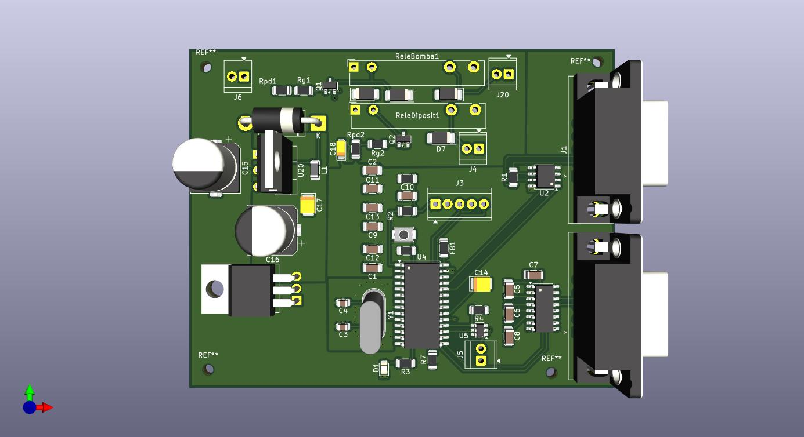

View this project on [CADLAB.io](https://cadlab.io/project/30189). 

# Projecte Combustible

>**Autors:** David Puges & Victor Donet
>**Versió: ** v.1.0.0 11/03/2026

----------

*3D render of the Fuel Management Electronic Module designed in KiCad 9. 
The board integrates a PIC24HJ128GP502 microcontroller, CAN bus (MCP2562), 
RS232 (MAX3232), 12-bit I2C DAC (MCP4725), two 12V/6A power relays and a 
complete power management stage (buck LM2596 + LDO LM1117).*

----------
## Objectiu Descripció breu de l'objectiu del projecte.

L'objectiu del projecte és crear una pcb capaç de controlar el mecanisme de tancament de dipòsit del combustible d'un cotxe, controli el sensor de pressió de pneumàtics i el sensor digital de nivell de combustible i el funcionament de la bomba de combustible.

## Diagrama de blocs

-----------

## Requisits / Especificacions

  - Una etapa regulador de tensió per alimentar tots el components de la placa.
  - Tenir un microcontrolador encarregat del control de la nostra placa.
  - Tenir una connexió BUS CAN, I2C.
  - Una comuniació USART per connectar el microcontrolador a aparells extern ja ve sigui un ordinador.
  - Tenir entrades com un boto per a que s'interección amb la placa.

-----------

## Components

| Descripci&#243; | Ref | Package |Datasheet | Prove&#239;dor | Unitats |
| --- | --- | --- | --- | --- | --- |
| Microcontrolador | PIC24HJ128GP502 | SOIC-28 |[Datasheet](https://ww1.microchip.com/downloads/aemDocuments/documents/OTH/ProductDocuments/DataSheets/70293G.pdf) | Mouser| 1x |
| XTAL-Ressonador | X49SM8MSD2SC | SMD |[Datasheet](https://www.lcsc.com/datasheet/C326536.pdf?spm=wm.sxq.inf.ggs___wm.ssy.bg.1.xh&lcsc_vid=QgJYBQUFQwQLBQFXFFAPUVFUTlMLX1dREgBeXgEFFlAxVlNRQFVfX1RVQVBdUDsOAxUeFF5JWBYZEEoKFBINSQcJGk4%3D) | [LCSC] | 1x |
| Regulador de tensió        | LM1117            | SOT-223 | [Enllaç](https://www.ti.com/lit/ds/symlink/lm1117.pdf) | Mouser | 1 |
| Regulador de commutació    | LM2596            | TO-220 / TO-263 | [Enllaç](https://www.ti.com/lit/ds/symlink/lm2596.pdf) |Mouser | 1 |
| Transceptor CAN            | MCP2557           | SOIC-8  | [Enllaç](https://www.digikey.es/es/products/detail/microchip-technology/MCP2557FD-H-SN/6009299?gclsrc=aw.ds&&utm_adgroup=&utm_source=google&utm_medium=cpc&utm_campaign=PMax_Product_All%20Products&utm_term=&productid=6009299&utm_content=&utm_id=go_cmp-20199915072_adg-_ad-__dev-c_ext-_prd-6009299_sig-Cj0KCQjw_JzABhC2ARIsAPe3ynpUKI6YB1CwYhuxLEUHioMMJoSxuswcCzv73NbuUfjEhpO7h3KmzM0aAg-ZEALw_wcB&gad_source=1&gbraid=0AAAAADrbLli4DwHuL2SABBDwoZRf1ZzGQ&gclid=Cj0KCQjw_JzABhC2ARIsAPe3ynpUKI6YB1CwYhuxLEUHioMMJoSxuswcCzv73NbuUfjEhpO7h3KmzM0aAg-ZEALw_wcB&gclsrc=aw.ds) | DigiKey | 1 |
| Convertidor DAC            | MCP4725           | SOT-23-6 | [Enllaç](https://ww1.microchip.com/downloads/en/devicedoc/22039d.pdf) | DigiKey / Mouser | 1 |
| Relé | Fujitsu_FTR-LYAA005Y | SPST-Vertical | [Enllaç](https://www.fujitsu.com/sg/imagesgig5/ftr-ly.pdf) | Mouser | 2 |
| Díode protector | PMEG6030EP | Diode_SMD:D_SOD-128 | [Enllaç](https://www.vishay.com/docs/88516/1n5400.pdf) | Mouser | 2 |
| Pulsador reset | SKRKAEE020 | SW_Push_SPST_NO_Alps_SKRK | [Enllaç](https://www.mouser.es/datasheet/2/15/SKRK-1370789.pdf) | Mouser | 1 |
| Connector DB9 | DB9 PINS | DSUB-9 THT | [Enllaç](https://www.we-online.com/components/products/datasheet/61800925123.pdf?srsltid=AfmBOoq6FDOjEsmwkl3Im1lC_McuY10mhKZld1XstQI9LiwjvFeB6EgA) | Digikey | 1 |
| Connector 01x02 | 61300211121 | PinHeader_1x02_P2.54mm_Vertical | [Enllaç](https://www.we-online.com/components/products/datasheet/61300211121.pdf) |Digikey | 4 |
| Connector ISCP | 61200621621 | PinHeader_2x03_P2.54mm_Vertical | [Enllaç](https://www.we-online.com/components/products/datasheet/61200621621.pdf) | Digikey | 1 |
| Connector Usart | 61300611121 | PinHeader_1x06_P2.54mm_Vertical | [Enllaç](https://www.we-online.com/components/products/datasheet/61300611121.pdf) | Digikey | 1 |
-----------

### Eines:

  * KiCad 9.0 o superior 

### Funcionalitats:

  - El mecanisme de tancament i obertura del dipòsit de combustible
  - Un sensor digital del nivell de combustible
  - El mecanisme que controli la bomba de combustible
  - Un sensor que ens avisi quan la pressió dels pneumàtics sigui baixa 

-----------

